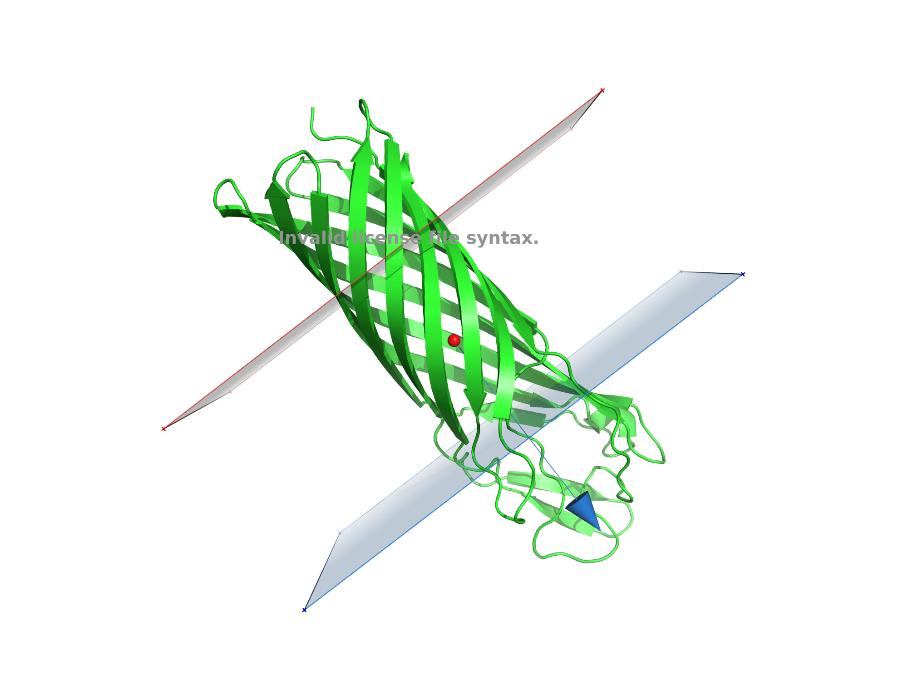
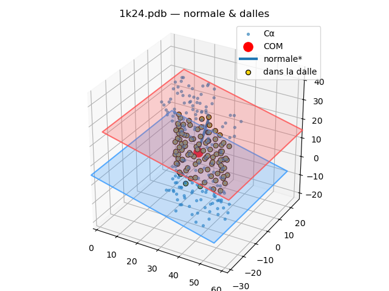

# SUJET : ASSIGNATION ET DETECTION DES PARTIES TRANSMEMBRANAIRES D'UNE PROTÉINE

**Auteur :** Inès MANOUR  
**Niveau :** Master 2 Bioinformatique  
**Année :** 2025-2026

---

## 🧬 Contexte

Les protéines transmembranaires jouent un rôle clé dans la signalisation cellulaire et les échanges moléculaires.  
L’objectif de ce projet est d’**implémenter une méthode automatique** pour :

- Identifier les régions transmembranaires à partir de structures PDB.  
- Associer hydrophobicité et accessibilité au solvant (RSA, via DSSP).  
- Estimer la position et l’orientation de la membrane.  
- Visualiser la membrane et les dalles associées en **PyMOL** ou **Matplotlib**.  

La méthodologie suit la publication de **Tusnády–Dosztányi–Simon (2004, Bioinformatics)** et utilise la **scale de Kyte–Doolittle** pondérée par RSA.

---

## 📂 Organisation du dépôt 

```
adpt-project/
├── data/                     
│   ├── 1K24.pdb
│   
│
├── results/             
│   ├── 2025-09-10/      
│   │   ├── 1K24_A_plot.png
│   │   ├── 1K24_A.csv
│   │   └── 1K24_A.pml
│   
│
├── src/                 # Code source Python
│   ├── main.py          # Script principal (CLI)
│   ├── protein.py       # Parsing PDB/DSSP, extraction Cα
│   ├── geometrie.py     # Projection, slabs, optimisation
│   ├── hydrophobicite.py # Scores hydrophobes (KD × RSA)
│   ├── visualisation.py # Matplotlib + PyMOL .pml
│   
│   └─ envi.yml 
│
└── README.md

```

---

## ⚙️ Installation

### 1. Cloner le dépôt
```
git clone https://github.com/ines-manour/adpt-project.git
cd adpt-project
```


### 2. Créer un environnement Python

#### Option — avec Pixi 

```
pixi init 
pixi install
pixi add python>=3.10 numpy matplotlib biopython dssp
pixi add pymol-open-source
pixi shell
```


### 2. Lancer l’analyse

exemple avec 1K24.pdb 

```
python src/main.py --pdb data/1K24.pdb --chain A \
  --n_dirs 192 --pas 1.0 \
  --demi_epaisseur 12.5 \
  --min-half 11.5 --max-half 13.5 \
  --widen-step 0.25 --max-half-extra 1.5 \
  --rsa-thresh 0.22 \
  --plot --pml view_membrane.pml
```

### 3. Visualiser les résultats

#### Exemple avec 1k24pdb :  

```
  • --pdb PATH → le fichier PDB à analyser (ex: data/1K24.pdb).

	•	--dssp PATH → fournir un fichier .dssp déjà calculé (sinon on lance mkdssp).

	•	--membrane-dir PATH / --globular-dir PATH → dossiers pour traiter un batch si --pdb n’est pas donné.

	•	--chain A → limite l’analyse à la chaîne donnée (A, B, …).

	•	--mkdssp /chemin/vers/mkdssp → chemin explicite si mkdssp n’est pas dans le PATH.

	•	--n_dirs N → nombre de directions testées (échantillonnage sphère). Plus grand = plus précis, plus long.

	•	--pas Δ (Å) → pas de déplacement de la dalle pendant l’optimisation interne (selon ton implémentation).

	•	--demi_epaisseur W0 (Å) → demi-épaisseur initiale de la dalle (point de départ de l’optimisation).

	•	--plot → produit les figures Matplotlib et les sauvegarde en PNG dans results/.

	•	--dirs-first → si --plot, sauvegarde aussi la vue COM + directions avant scoring (*_dirs.png).
	•	--pml anything → active l’export PyMOL ; on écrit results/<PDB>[_<chain>].pml (le nom passé n’est pas utilisé).

	•	--head N → affiche les N premiers résidus avec ASA/RSA (contrôle rapide).

	•	--widen-step s (Å) → pas d’élargissement quand on augmente/reduit l’épaisseur pendant l’optimisation.

	•	--max-half-extra e (Å) → marge max ajoutée à la demi-épaisseur initiale (contrôle jusqu’où on peut élargir).

	•	--no-widen → désactive l’élargissement (équivaut à --max-half-extra 0).

	•	--rsa-thresh t (0–1) → seuil sur la pondération (RSA ou 1−RSA) pour qu’un résidu contribue au score.

	•	--min-half a, --max-half b (Å) → bornes imposées sur la demi-épaisseur optimisée (-1 pour désactiver).
  
	•	--results-dir PATH → dossier de sortie pour CSV / PNG / PML (results/ par défaut).
```

##### Résultats : 

##### • En console :

    ```
    python src/main.py --pdb data/1K24.pdb --chain A \
>   --n_dirs 192 --pas 1.0 \
>   --demi_epaisseur 12.5 \
>   --min-half 11.5 --max-half 13.5 \
>   --widen-step 0.25 --max-half-extra 1.5 \
>   --rsa-thresh 0.22 \
>   --plot --pml view_membrane.pml

=== 1K24.pdb ===
- Cα lus : 249
- ASA (DSSP) : 249/249
- RSA moyenne : 0.288
- Centre de masse (Cα) : 30.403, -2.402, 9.879

--- Scores par direction (Q) ---
 1. Q=1.210 | n=[-0.707  0.186  0.682] | centre=-0.71 Å | demi-ép=13.50 Å | d_in=-14.21 Å | d_out=12.79 Å
 2. Q=1.156 | n=[-0.745  0.382  0.547] | centre=-0.74 Å | demi-ép=13.50 Å | d_in=-14.24 Å | d_out=12.76 Å
 3. Q=1.060 | n=[ 0.709 -0.432 -0.557] | centre=0.71 Å | demi-ép=13.50 Å | d_in=-12.79 Å | d_out=14.21 Å
 4. Q=1.040 | n=[-0.304  0.432  0.849] | centre=-0.30 Å | demi-ép=13.50 Å | d_in=-13.80 Å | d_out=13.20 Å
 5. Q=1.040 | n=[ 0.312 -0.465 -0.828] | centre=0.31 Å | demi-ép=13.50 Å | d_in=-13.19 Å | d_out=13.81 Å
 6. Q=0.983 | n=[-0.528  0.367  0.766] | centre=-0.53 Å | demi-ép=13.50 Å | d_in=-14.03 Å | d_out=12.97 Å
 7. Q=0.936 | n=[ 0.51  -0.032 -0.859] | centre=0.51 Å | demi-ép=13.50 Å | d_in=-12.99 Å | d_out=14.01 Å
 (..)

→ Q_max = 1.210
- Normale estimée              : [-0.70693251  0.18634514  0.68229167]
- Centre optimal (le long de n): -0.71 Å
- Score max (KD×(1−RSA) moy.)  : 1.210
- Demi-épaisseur optimale      : 13.50 Å (épaisseur ≈ 27.00 Å)
- Positions d_in / d_out       : -14.21 Å / 12.79 Å le long de n
- Centres des dalles (3D)      : IN  = [40.446, -5.050, 0.186] | OUT = [21.359, -0.018, 18.607]
/Users/manour/Desktop/M2BI/gestion_projet/projet/src/visualisation.py:207: UserWarning: FigureCanvasAgg is non-interactive, and thus cannot be shown
  plt.show()
[OK] PNG: results/1K24_A_plot.png
[PyMOL] Script écrit → results/1K24_A.pml  | Dans PyMOL : @1K24_A.pml
[OK] PML: results/1K24_A.pml
[OK] CSV: results/1K24_A.csv
```


##### •	En PyMOL :
    
**Figure PyMOL :**



•	En Matplotlib :
Si --plot est activé, un rendu 3D interactif s’ouvre.

**Figure Matplotlib :**



## 🎓 Notes pédagogiques

	•	Le code est écrit selon PEP 8 et documenté selon PEP 257.
	•	Usage de @dataclass pour simplifier les classes de données (ResidueCA).
	•	Modularité : chaque fichier Python est spécialisé (proteine, géométrie, hydrophobicité, visualisation).
	•	Paramètres ajustables : seuil RSA, épaisseur, nombre de directions.
	


## 📚 Références
	•	Tusnády, G.E., Dosztányi, Z., Simon, I. (2004). Transmembrane proteins in the Protein Data Bank: identification and classification. Bioinformatics, 20(17), 2964–2972.
	•	Kyte, J., & Doolittle, R.F. (1982). A simple method for displaying the hydropathic character of a protein. J Mol Biol, 157(1), 105–132.
	•	DSSP: Kabsch, W., & Sander, C. (1983). Dictionary of protein secondary structure. Biopolymers, 22(12), 2577–2637.